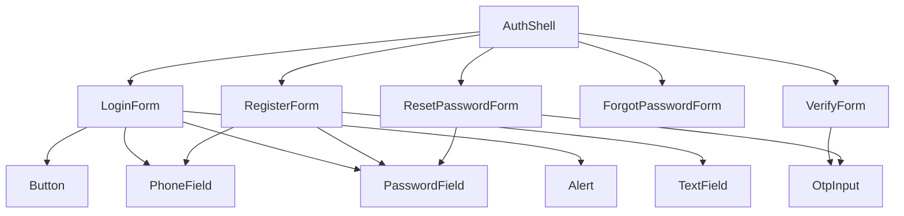

# Reusable components plan — auth

Building blocks for login, register, verify, and forgot-password flows. **shadcn/ui** primitives live in `components/ui` (Button, Input, Label, Card, Alert, Field). Auth-specific wrappers go in `components/auth`. Visual specs live in [design-book.md](./design-book.md).

### shadcn components already installed

| Component | Path | Use |
| --- | --- | --- |
| Button | `components/ui/button.tsx` | Primary CTA, secondary actions |
| Input | `components/ui/input.tsx` | Text, phone (with props) |
| Label | `components/ui/label.tsx` | Field labels |
| Card | `components/ui/card.tsx` | Auth shell card |
| Alert | `components/ui/alert.tsx` | API errors / success |
| Field | `components/ui/field.tsx` | Label + control + error layout |

## Layout

### `AuthShell`

**Path:** `components/ui/auth-shell.tsx`  
**Type:** Server or client (no state)

**Props:**

| Prop | Type | Description |
| --- | --- | --- |
| `title` | string | Page heading inside card |
| `subtitle` | string? | Muted helper under title |
| `children` | ReactNode | Form or step content |
| `footer` | ReactNode? | Links below form (e.g. “Create account”) |

**Structure:** Full-viewport `bg-page`, centered card (`max-w-[420px]`, `bg-card`, padding, radius 10px). Optional logo slot at top of card.

---

## Primitives (`components/ui`)

### `Button`

**Props:** `variant: 'primary' | 'secondary' | 'ghost'`, `loading?: boolean`, `disabled?: boolean`, standard button HTML props.

**Behavior:** Primary uses `bg-primary` / hover `primary-hover`; shows spinner or “Loading…” when `loading`; `aria-busy` when loading.

---

### `TextField`

**Props:** `label`, `name`, `error?: string`, `hint?: string`, plus native input props (except className override pattern).

**Behavior:** Associates label with input; error text below with `text-danger`; focus ring per design book.

---

### `PasswordField`

**Props:** Same as `TextField` plus optional `autoComplete`.

**Behavior:** Extends `TextField` with show/hide toggle; `type` toggles between `password` and `text`.

---

### `PhoneField`

**Props:** Same as `TextField`.

**Behavior:** `inputMode="numeric"`, strip non-digits on change, max length 11 for BD mobiles; optional format hint “01XXXXXXXXX”.

---

### `OtpInput`

**Props:** `length?: number` (default 6), `value`, `onChange`, `error?: string`, `disabled?: boolean`.

**Behavior:** Row of single-character inputs; auto-advance focus; paste full code; `onChange` emits combined string or number for API.

---

### `Alert`

**Props:** `variant: 'error' | 'success' | 'info'`, `children` (message, usually API `message`).

**Behavior:** `error` → `bg-danger-soft` + `text-danger`; used once per form at top of fields.

---

## Auth forms (`components/auth`)

Each form is a client component that composes primitives and calls `lib/api` helpers (to be added).

| Component | Route | API sequence |
| --- | --- | --- |
| `LoginForm` | `/login` | `POST /user/login` → store tokens → redirect |
| `RegisterForm` | `/register` | `POST /user` → redirect to verify with phone in query/state |
| `VerifyForm` | `/verify` | `POST /user/verify`; link to resend → `POST /user/resend-otp` |
| `ForgotPasswordForm` | `/forgot-password` | `POST /forget-password/user` → redirect to reset with phone |
| `ResetPasswordForm` | `/reset-password` | `POST /otp/validate/verify` then `PATCH /user/reset-password` |

**Shared form patterns:**

- Submit disables button and sets loading on primary `Button`.
- Catch API errors and show `Alert` with `message`.
- Secondary links: Next.js `Link` with `text-primary` and hover underline.

---

## File checklist (implementation order)

1. ~~`Button`, `Input`, `Label`, `Alert`, `Card`, `Field`~~ (shadcn)
2. `PasswordField`, `PhoneField` (wrap `Input`)
3. `AuthShell` (compose `Card`)
4. `OtpInput`
5. `LoginForm` + page
6. `RegisterForm` + `VerifyForm` + pages
7. `ForgotPasswordForm` + `ResetPasswordForm` + pages

---

## Dependencies between components

No shared form library (React Hook Form, etc.) is required in the plan; add only if a form grows beyond simple state.
